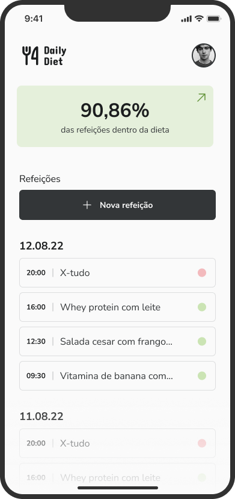
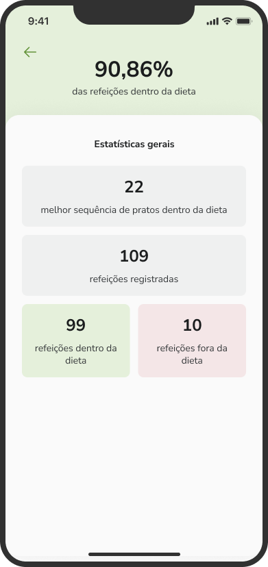
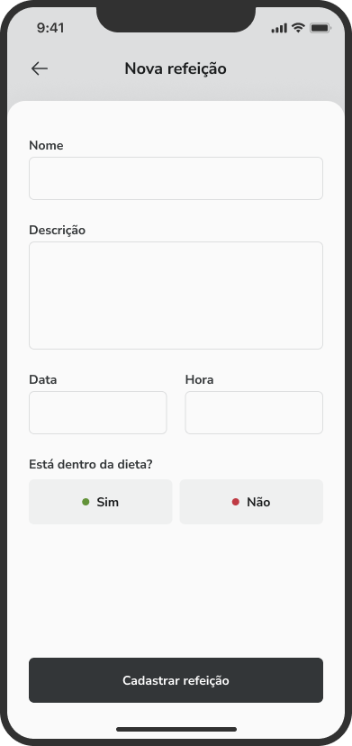
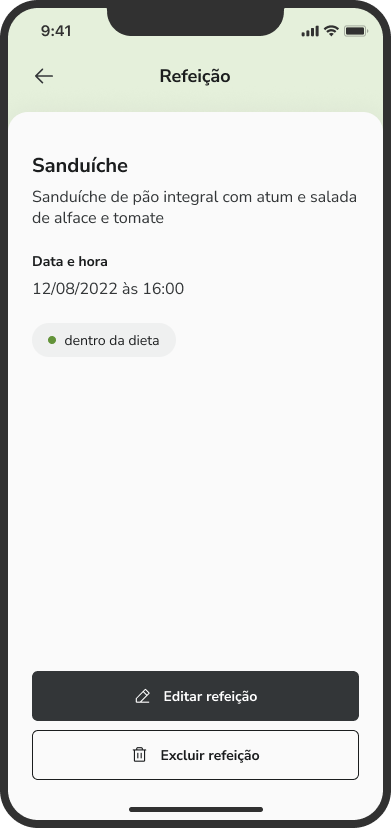
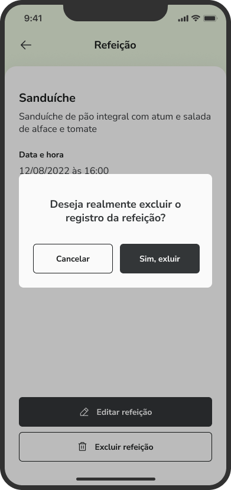

## 💻 Daily Diet 

### Objective:
- App designed to manage meals, listing whether they are within or outside the user's diet. The application also provides a tally of total meals, number of meals within and outside the diet, percentage of meals within the diet, and a count of consecutive dishes within the diet.
- It is possible to create new meals, edit existing ones, delete them, and list them.

### See the project...

  
  
  
 
  
  
  

### Techs
- React Native
- Typescript
- Styled Components
- Async Storage
- Phosphor-react-native (Icons)
- Babel-plugin-module-resolver
